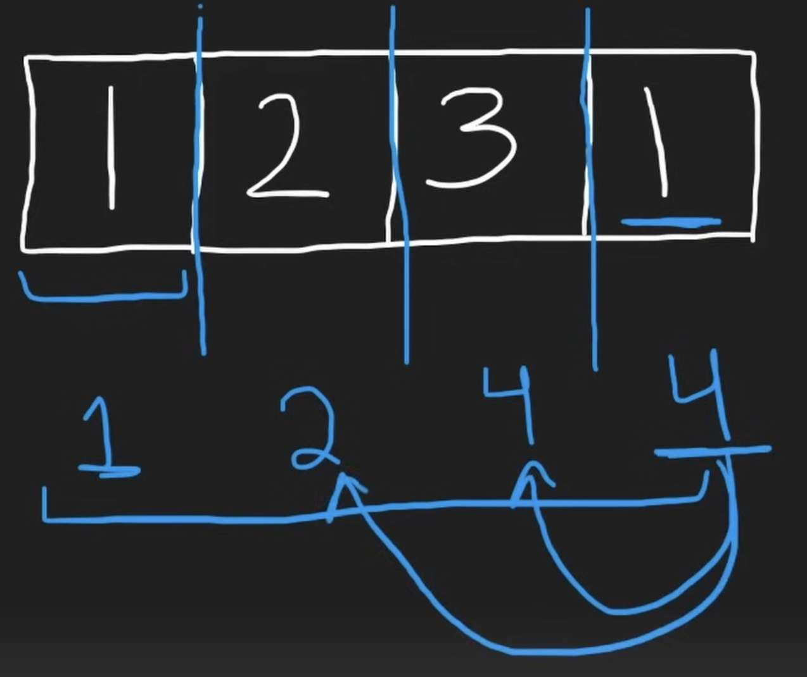

# 198. House Robber

[198. House Robber](https://leetcode.com/problems/house-robber/)

## Problem

You are a professional robber planning to rob houses along a street. Each house has a certain amount of money stashed, the only constraint stopping you from robbing each of them is that adjacent houses have security systems connected and **it will automatically contact the police if two adjacent houses were broken into on the same night**.

Given an integer array `nums` representing the amount of money of each house, return _the maximum amount of money you can rob tonight **without alerting the police**_.

## Solution

To solve the 'House Robber' problem, we keep track of two values as we iterate through the array: rob1 and rob2. rob1 holds the maximum amount that can be robbed from the previous position, and rob2 holds the maximum amount from the current position. At each step, we calculate the potential maximum amount by adding the current house's value to rob1, ensuring we don't rob adjacent houses. We then compare this potential maximum to rob2 and update rob1 to rob2 and rob2 to the greater of the two values. This process repeats for each house, and by the end, rob2 represents the maximum amount that can be robbed without triggering. Thus, the final value of rob2 is the answer we're looking for.



```typescript
function rob(nums: number[]): number {  
  let rob1 = 0;  
  let rob2 = 0;  
  
  for (let n of nums) {  
    const temp = Math.max(n + rob1, rob2);  
    rob1 = rob2;  
    rob2 = temp;  
  }  
  
  return rob2;  
};
```
