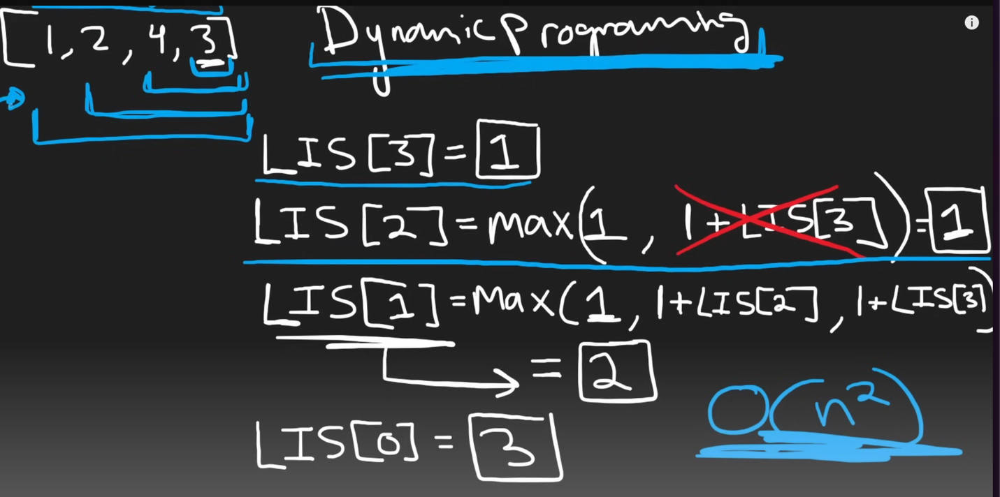

# 300. Longest Increasing Subsequence

[300. Longest Increasing Subsequence](https://leetcode.com/problems/longest-increasing-subsequence/)

## Problem

Given an integer array `nums`, return _the length of the longest **strictly increasing**_ _**subsequence**_

A **subsequence** is an array that can be derived from another array by deleting some or no elements without changing the order of the remaining elements.

## Solution

To solve this problem, we introduce a dynamic programming approach. We will break it down into smaller tasks to find the longest increasing subsequence in the whole array.  For each position in the whole array, calculate the longest subsequence at each position to the last position and record. Therefore, we can compare these records to find the longest increasing subsequence in the entire array.

First, we make an array called LIS with the same length as `nums`, fill 1. Each element `LIS[i]` represents the longest subsequence of position I to the last position in the array.
Then, we iterate through the array backward. Use two nested loop update `LIS` arrays. The outside loop variable `i` represents the current position, and the inside loop variable `j` begins `i + 1` and iterates through the I after all elements.

If we meet `nums[i]` less than the `nums[j]`, then mean nums[j] and nums[i] can make an increasing subsequence. So, we update the greater value between  `LIS[i]` and `LIS[j] + 1`. Such that we can ensure LIS[i] is the longest subsequence at I to the last position so far.
Untill all loop endings, we find the maximum value in the `LIS` array. It's the longest increasing subsequence of the whole array.

Through this process, we not only avoided the duplicate calculation, and solved it effectively.



```typescript
function lengthOfLIS(nums: number[]): number {  
  let LIS = new Array(nums.length).fill(1);  
  
  for (let i = LIS.length - 1; i >= 0; i--) {  
    for (let j = i + 1; j < nums.length; j++) {  
      if (nums[i] < nums[j]) {  
        LIS[i] = Math.max(LIS[i], 1 + LIS[j]);  
      }  
    }  
  }  
  
  return Math.max(...LIS);  
};
```

## Be better

"To solve the Longest Increasing Subsequence problem, we use a dynamic programming strategy. This method breaks down the main problem into smaller, manageable tasks, where we calculate the maximum length of an increasing subsequence from each position in the array to the end. We keep track of these lengths in an array called LIS.

Here's how we do it:

1. Initialize the LIS array with the same length as `nums`, filled with 1s. Each element `LIS[i]` represents the longest subsequence starting at position `i`.

2. Loop through the `nums` array from back to front. For each position `i`, compare it with every other position `j` that comes after `i`.

3. If `nums[i]` is less than `nums[j]`, it means that `nums[i]` can be part of an increasing subsequence ending with `nums[j]`. Update `LIS[i]` to the maximum of its current value or the value of `LIS[j] + 1` to extend the subsequence.

4. After updating all positions, the maximum value in the LIS array gives us the length of the longest increasing subsequence in the entire array.


This approach is efficient because it builds upon previous calculations, ensuring no work is repeated unnecessarily."
