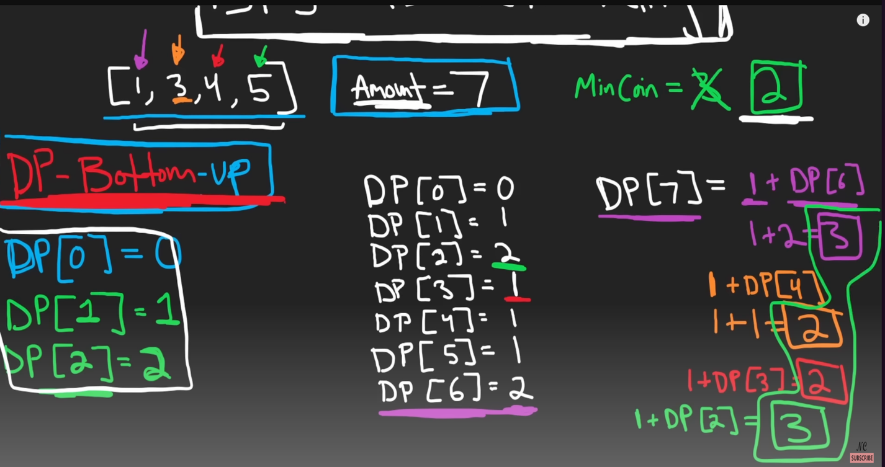

# 322. Coin Change

322. Coin Change](https://leetcode.com/problems/coin-change/)

## Problem

You are given an integer array `coins` representing coins of different denominations and an integer `amount` representing a total amount of money.

Return _the fewest number of coins that you need to make up that amount_. If that amount of money cannot be made up by any combination of the coins, return `-1`.

You may assume that you have an infinite number of each kind of coin.

## Solution

I can use dynamic programming to solve this problem because it lets me break down a big problem into smaller tasks. Each small task uses the results from the previous tasks.

I create an array where each index represents an amount, and the value at each index shows the minimum coins needed for that amount. I don't start from scratch when I need to calculate the coins for an amount. I just find a suitable coin for the current amount and add the minimum coins needed for the remaining amount (current amount minus the coin value).

So, for each amount, I go through each usable coin. I keep track of the minimum number of coins needed and update the value for that amount in the array until all amounts are processed.

In the end, if the final amount has been updated from its initial value, it means I've found the minimum coins needed for that amount. If not, the answer is -1.



```typescript
function coinChange(coins: number[], amount: number): number {
  // Initialize an array to store the minimum coins needed for each amount up to the target amount.
  // We fill the array with amount + 1, which acts as an "infinity" placeholder value to be minimized later.
  let dp = new Array(amount + 1).fill(amount + 1);

  // Base case: the minimum coins needed to make an amount of 0 is 0.
  dp[0] = 0;

  // Start building up the dp array from the smallest amount (1) to the target amount.
  for (let a = 1; a <= amount; a++) {
    // Iterate through each coin.
    for (let c of coins) {
      // If the current amount minus the coin value is non-negative,
      // it means we can use this coin for the current amount.
      if (a - c >= 0) {
        // Update the dp array for the current amount to be the minimum of itself
        // or 1 plus the number of coins needed for the amount that remains after using coin c.
        dp[a] = Math.min(dp[a], 1 + dp[a - c]);
      }
    }
  }

  // After filling the dp array, if the value at the index equal to the target amount
  // is not our "infinity" value, it means we found a minimum count for the amount.
  // Otherwise, return -1 to indicate it is not possible to make the amount with any combination of coins.
  return dp[amount] !== amount + 1 ? dp[amount] : -1;
}
```
